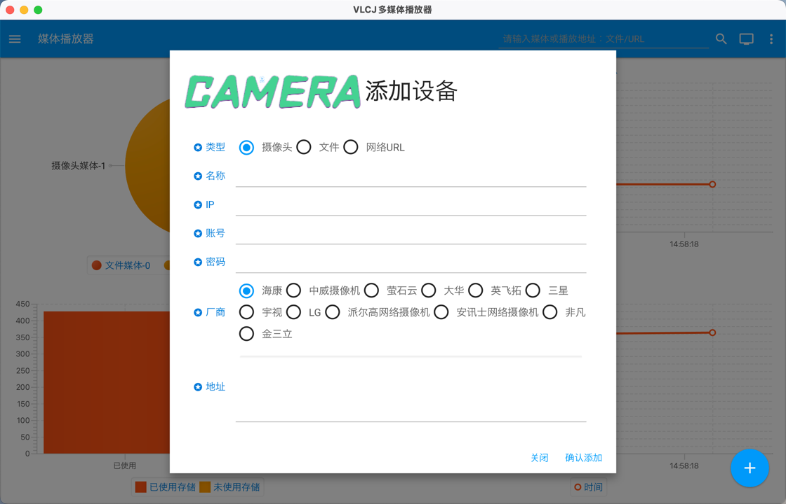
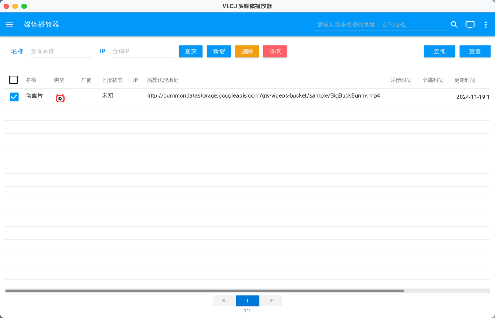

# jfx-media
使用JavaFx开发的桌面应用程序，包括视频流播放等一些功能，可以播放摄像头的rtsp协议，本地map4等文件，包括网路视频URL，理论上是VLC可以播放的格式都可以播放。

* 使用Springboot3.2结合JavaFx开发，使用Maven构建项目
* UI框架用的是GluonFX，一个JavaFx的UI框架，可以参考：https://docs.gluonhq.com/#_attach_with_gluonfx_plugin
* 使用VLCJ作为视频播放器，可以参考：https://www.videolan.org/
* 使用H2数据库处理数据存储，包括一些配置和媒体等。使用Mybatis框架处理增删改查等。

## 核心技术栈

| 技术栈                  | 版本         |
|----------------------|------------|
| Java                 | 17+        |
| JavaFx               | 21+        |
| Spring               | 6.1.14     |
| Spring Boot          | 3.2.11     |
| Mybatis Plus         | 3.5.8      |

## 如何使用

* 打开软件添加一个媒体源
* 
* 选择点击播放即可

## IDEA开发
* 启动项目时请添加JVM参数，根据自己的javafx的jdk包路径来： --module-path=/Users/***/aliyun/newjava/vlcj/javafx-sdk-21.0.5/lib -Dprism.dirtyopts=false -Dprism.forceUploadingPainter=true -XX:+UnlockExperimentalVMOptions -XX:+UseShenandoahGC  --add-opens java.base/java.lang=ALL-UNNAMED --add-modules javafx.controls,javafx.fxml

## 开源协议
Apache Licence 2.0 （[英文原文](http://www.apache.org/licenses/LICENSE-2.0.html)）
Apache Licence是著名的非盈利开源组织Apache采用的协议。该协议和BSD类似，同样鼓励代码共享和尊重原作者的著作权，同样允许代码修改，再发布（作为开源或商业软件）。
需要满足的条件如下：
* 需要给代码的用户一份Apache Licence
* 如果你修改了代码，需要在被修改的文件中说明。
* 允许免费用于学习、毕设、公司项目、私活等，但请保留源码作者信息。
